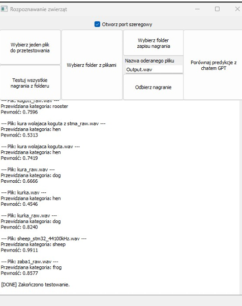
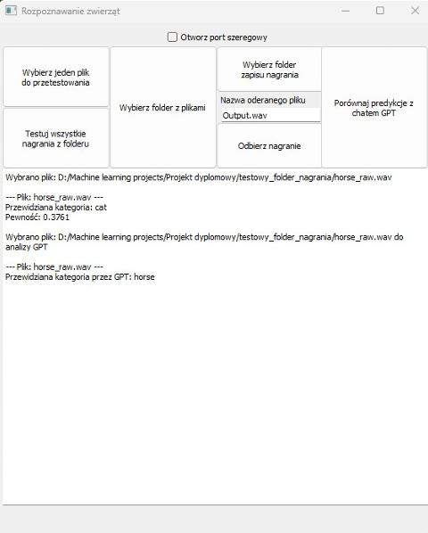
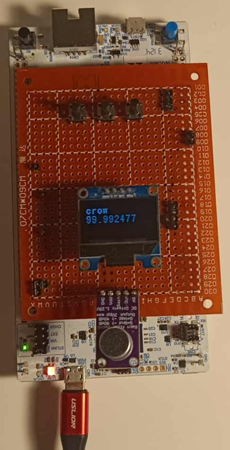
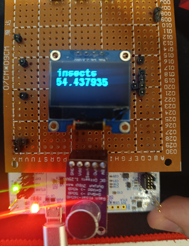
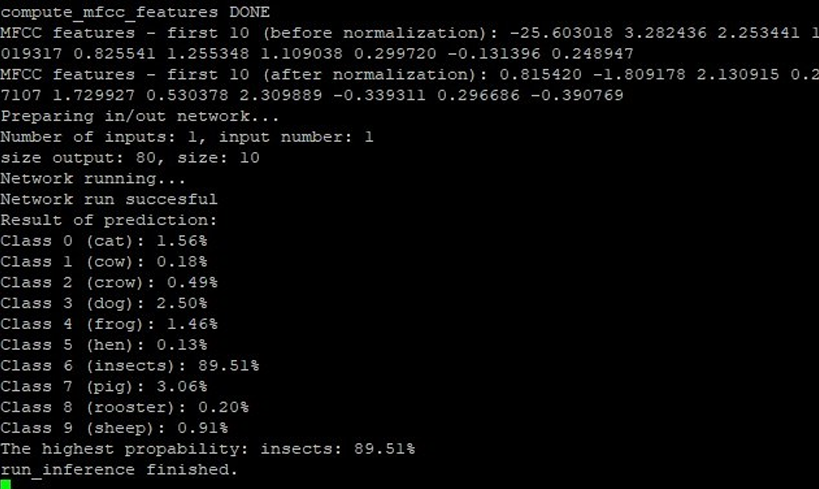

# 📚 Embedded Animal Sound Recognition System

This project, developed as a diploma project for the "Artificial Intelligence and Machine Learning" postgraduate program at WSB Merito University, focuses on the design and implementation of an embedded animal sound recognition system. The core of the system is the STM32 Nucleo-H753ZI microcontroller, utilizing a custom neural network built with TensorFlow, NumPy, and Scikit-learn. The system utilizes the [ESC-50 dataset](https://github.com/karolpiczak/ESC-50) for training.
---

## 🚀 Functionalities

- The system consists of two main components: an embedded device and a desktop application,
- Audio Processing: Real-time audio signal acquisition and MFCC (Mel-frequency cepstral coefficients) feature extraction,
- Comparison & Benchmarking: A dedicated desktop app for data visualization and performance comparison between the trained local model and OpenAI’s GPT-4o Audio Preview,
- The embedded device can record 5s and display the result of prediction,
- Visualization: Real-time feedback and results display on both the embedded device and the companion application.
  

## 🛠️ Technology
- Python,
- C,
- STM32CubeIDE,
- GitHub,
- VS Code.

## 🛠 Tech Stack
- Hardware: STM32 Nucleo-H753ZI,
- Machine Learning: TensorFlow, Scikit-learn, NumPy,
- Dataset: [ESC-50](https://github.com/karolpiczak/ESC-50)
- Cloud AI: OpenAI API (GPT-4o Audio Preview),
- Signal Processing: MFCC extraction.
